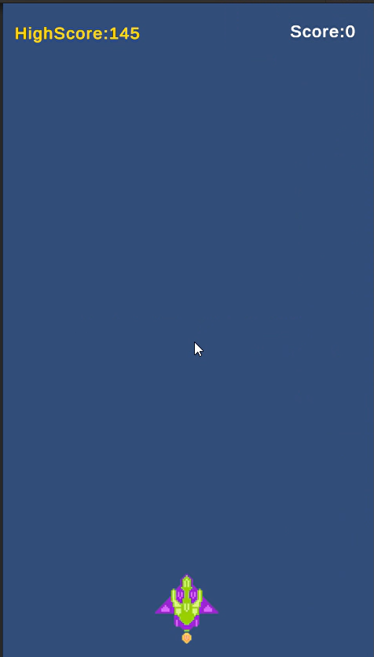
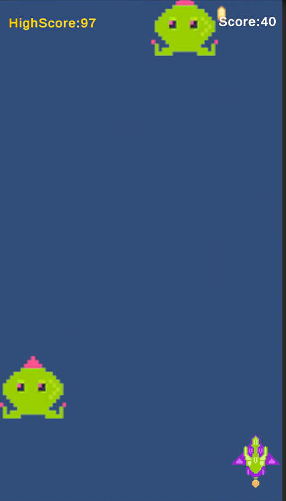
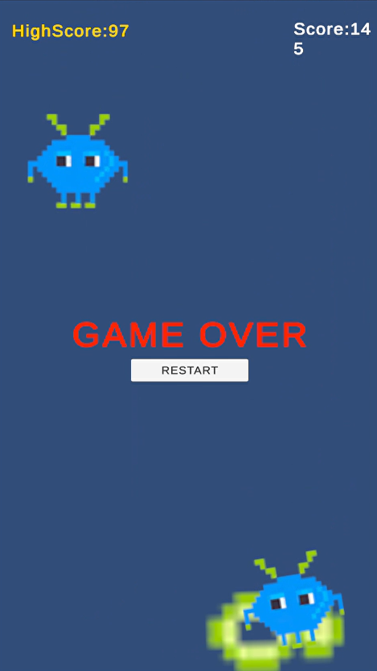

# 🚀 Jogo 2D de Nave Espacial – Unity

Desenvolvido como parte da capacitação **Samsung Ocean**, este projeto é um jogo em Unity 2D onde o jogador controla uma nave que deve destruir inimigos enquanto acumula pontos. O jogo possui animações, sistema de pontuação e uma interface interativa.

---

## 🎮 Demonstração

> Imagens do jogo em ação (adicione aqui imagens ou gifs)





---

## 🛠️ Tecnologias Utilizadas

- Unity 2D
- C#
- Unity Input System
- TextMeshPro
- Git + GitHub
- Spritesheet para animações

---

## 🧠 O que o projeto faz?

- Controla nave com movimento fluido (WASD / setas)
- Dispara com espaço e destrói inimigos
- Sistema de pontuação com **HighScore salvo**
- Efeitos visuais com explosões
- Tela de **Game Over** com botão de restart
- Geração aleatória de inimigos usando corrotinas

---

## 📁 Estrutura do Projeto

```bash
📦 JogoNave2D
 ┣ 📂 Assets/
 ┃ ┣ 📜 ControllerShip.cs
 ┃ ┣ 📜 Enemy.cs
 ┃ ┣ 📜 EnemysGenerator.cs
 ┃ ┣ 📜 GameController.cs
 ┣ 📂 Packages/
 ┣ 📂 ProjectSettings/
 ┣ 📜 .gitignore
 ┣ 📜 README.md


💡 Próximos Passos
 Adicionar trilha sonora e efeitos sonoros

 Sistema de Power-ups

 Pontuação online

 Build WebGL para jogar no navegador
